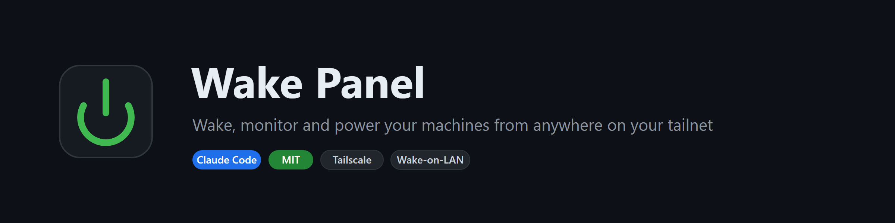

<p align="center">
  
</p>

<p align="center">
  <a href="https://github.com/REMvisual/claude-wol-remote-access/releases/latest">
    
  </a>
  <a href="https://github.com/REMvisual/claude-wol-remote-access/releases">
    
  </a>
</p>

<p align="center">
  
  
  
  
</p>

# Wake Panel

A password-protected web panel, hosted on an always-on device, that wakes,
monitors, and powers your computers from anywhere on your Tailscale network.

Open it on your phone. See which machines are up, how hot the GPU is, how much
VRAM is left, what model is loaded. Wake a machine that is fully powered off.
Sleep or reboot one that isn't.

```
phone (anywhere) --Tailscale--> always-on device --LAN broadcast--> your PC
```

> **Where this is today.** Wake Panel is a guided, interactive one-time setup:
> you run `/wake-panel` in Claude Code and it walks the whole build with you,
> stage by stage, on your own hardware. Once it is up it runs on its own and you
> never touch the skill again. A standalone app that does this without Claude
> Code is planned.

## Why a relay is necessary

A Wake-on-LAN magic packet is a **layer-2 broadcast**. Tailscale is layer 3 and
forwards no broadcast traffic.

This means **no app on your phone can wake a PC over Tailscale** — not Moonlight's
"Wake PC", not any WoL app, not a Tailscale subnet router advertising your LAN.
It is not a limitation to engineer around; it is how Wake-on-LAN works.

So the packet has to originate on your LAN. A small service on an always-on
device — NAS, Raspberry Pi, mini-PC, anything — turns an HTTP request from your
tailnet into a broadcast on the local segment.

The relay must **not** live on a machine you are controlling. A PC cannot wake
itself, and two PCs that are both off cannot wake each other.

## What you get

- Wake from full shutdown, from anywhere
- Sleep / reboot / shutdown over SSH
- Live vitals: GPU temperature, utilisation, VRAM, power draw, fan; CPU load;
  RAM; uptime; disks
- What is actually on the GPU, including the loaded model name for llama.cpp,
  vLLM, Ollama, and ComfyUI
- Password login with a long-lived session, so the home-screen icon just opens
- Polls **only while you are looking at it** — nothing touches your machines
  when the page is closed
- Optional **break-glass terminal**: a browser shell on the relay itself, for
  when every managed machine is down and you need to hand-build commands

## Quick start

### One-line install

```bash
curl -fsSL https://raw.githubusercontent.com/REMvisual/claude-wol-remote-access/main/install.sh | bash
```

Then, in Claude Code:

```
/wake-panel
```

The skill walks the whole setup end to end in gated stages — inventory, relay
deploy, per-target SSH and telemetry, password, and verification — and does most
of the work for you.

### Manual install

```bash
git clone https://github.com/REMvisual/claude-wol-remote-access.git
cp -r claude-wol-remote-access/skills/wake-panel "$HOME/.claude/skills/wake-panel"
```

## Requirements

| | |
|---|---|
| Always-on device | On the same LAN as the targets. Docker, or Python 3.9+ |
| Tailscale | On that device and on your phone |
| Target machines | **Wired Ethernet.** Wi-Fi WoL is unreliable |
| Access | Admin on each target, to install an SSH server |

No pip install, no npm, no database. The relay is standard-library Python.

## Setting it up by hand

1. Copy `skills/wake-panel/assets/relay/` to your always-on device.
2. Copy `hosts.example.json` to `hosts.json` and fill in your machines. Use the
   **wired** NIC's MAC — this is the most common mistake, and it fails silently.
3. On each target, run `skills/wake-panel/assets/agent/setup-host.ps1 -PublicKey '<relay key>'`
   elevated (Windows), or install `telemetry.sh` (Linux).
4. Set a password: `python skills/wake-panel/assets/tools/set-password.py | ssh user@relay 'cat > /path/secrets/config.json'`
5. Start it: `docker compose up -d`, or `python app.py`.
6. Open `http://<tailnet-ip>:8099` and add it to your home screen.

`network_mode: host` is mandatory in Docker. In a bridge network the broadcast
dies inside the container's private subnet, and the relay looks perfectly
healthy while never waking anything.

## Verify it actually works

**Test sleep first, then shutdown.** Waking from sleep proves nothing about
waking from a full shutdown — they arm the network card through different paths,
and S5 is usually gated in firmware.

The panel refuses to shut down any machine whose wake you have not verified.
Set `wol_verified: true` in `hosts.json` only after you have genuinely woken it
from powered-off, or a mis-tap leaves you walking to the power button.

If sleep-wake works and shutdown-wake does not, enable **Power On By PCI-E** in
the BIOS. See [TROUBLESHOOTING](skills/wake-panel/reference/TROUBLESHOOTING.md)
— the usual online answer (ErP Ready) is frequently not the cause.

## Optional: break-glass terminal

The panel gives you fixed verbs. When something unforeseen breaks, you may want a
shell *inside* the network instead. `skills/wake-panel/assets/relay/terminal-run.sh` runs a browser
terminal on the relay host, bound only to the tailnet interface and behind HTTP
basic auth, with a real toolbox (`ssh`, `nmap`, `dig`, `tcpdump`, `ip`) that a
NAS BusyBox userland does not have.

It fails closed — no credential file means it refuses to start rather than
serving an unauthenticated root shell. Pair it with a phone SSH client as an
independent fallback: a single break-glass mechanism that shares a failure mode
with the thing it rescues is not a fallback.

## Security

- Fails **closed**: with no credentials configured, nothing is served
- Password stored as an scrypt hash; the plaintext never touches a file or a log
- Session cookie is HMAC-signed, HttpOnly, SameSite=Lax
- Failed logins are rate-limited per IP
- Shutdown is blocked for unverified machines at the API, not just in the UI

The relay holds an SSH key that can power off your machines. Give it a dedicated
key, not your personal one, and keep the secrets directory off any network share.

## Notes

CPU temperature on Windows needs a helper app and is deliberately optional —
FanControl cannot provide it (it exposes no API), LibreHardwareMonitor can
conflict with FanControl, and HWiNFO's free tier stops after 12 hours a day.
GPU temperatures need none of this. On Linux the collector reads `hwmon`
directly with no helper at all.

## Uninstall

```bash
curl -fsSL https://raw.githubusercontent.com/REMvisual/claude-wol-remote-access/main/uninstall.sh | bash
```

## Contributing

Issues and PRs welcome — see [CONTRIBUTING.md](CONTRIBUTING.md).

## License

MIT — see [LICENSE](LICENSE).

---

If this saved you a trip to the power button, give it a star.
